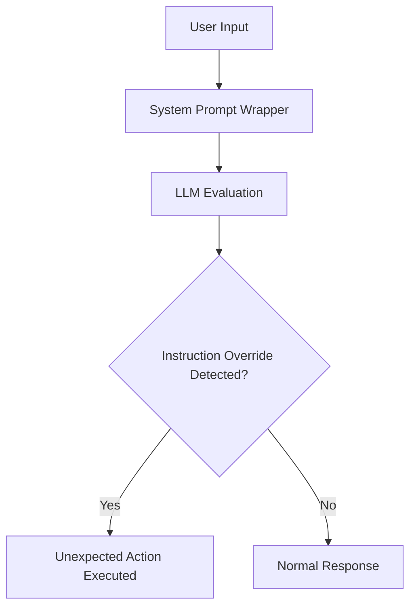
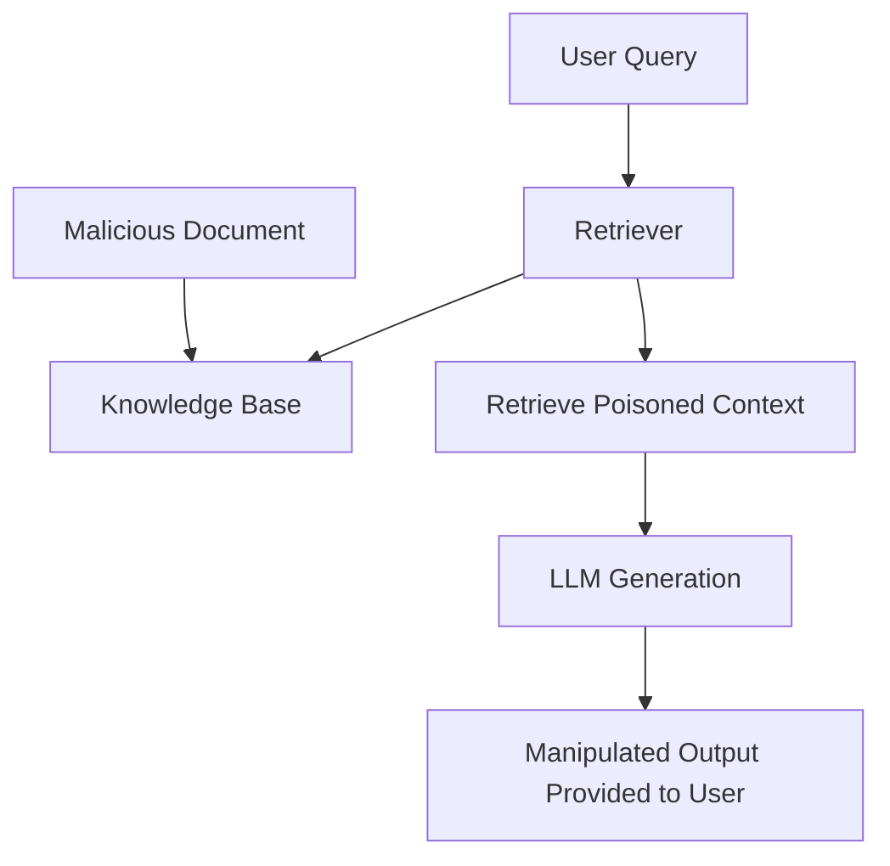

# AI Security Flows

These diagrams reflect the actual security concepts tested in the application's mock LLM engine.

## 1. Prompt Injection Flow


## 2. RAG Poisoning Flow


## 3. Excessive Agency Flow
```mermaid
flowchart TD
    A[User Prompt] --> B[AI Agent]
    B --> C{Permission Check?}
    C -->|Missing / Flawed| D[Execute Highly Privileged Tool]
    C -->|Proper| E[Access Denied]
    D --> F[Data Exfiltration / Modification]
```\n