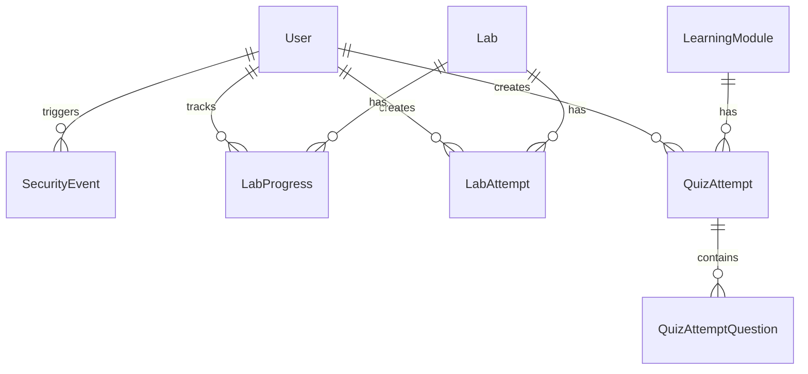

# Database Design

## Overview
The platform uses SQLAlchemy mapped to SQLite (local) or potentially PostgreSQL (production).

## ER Diagram

## Key Tables
- **Users**: Core auth table.
- **SecurityEvents**: Audit log for the SOC dashboard.
- **LabProgress**: User's state in a given lab.
- **QuizAttempt**: Stores session data for testing.\n