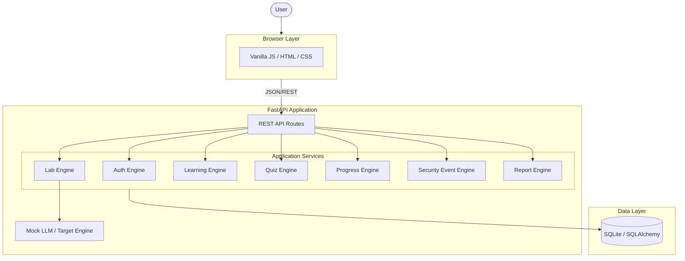

# System Architecture

## Overview
AI Security Lab is a monolithic Single-Page Application (SPA) backed by a FastAPI Python server. It employs a traditional n-tier architecture adjusted for a security simulation environment.

## High-Level Architecture Diagram

## Component Details
1. **Frontend**: Static files served by the backend or a CDN. Uses `app.js` to manage state globally (`window.LABS_CACHE`).
2. **Backend**: FastAPI running on Uvicorn. Uses Dependency Injection for Database sessions and Auth.
3. **Application Services**: Core logic located in `app/services/` separating API routing from business logic.
4. **Mock LLM**: Resides in `app/services/mock_llm.py` and `targets.py`. Processes inputs using regex and keyword logic to mimic LLM outputs safely.
5. **Data Layer**: SQLite database (`app/models/core.py`) tracking progress, users, events, and quiz attempts.\n