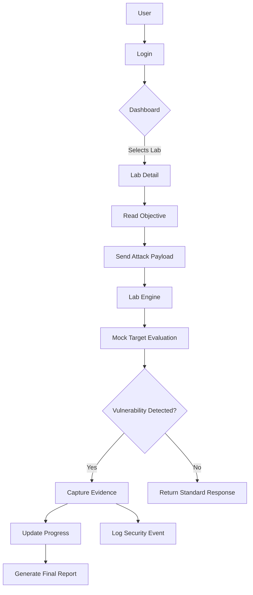

# System Flow

## User Journey


## Core Request Sequence
```mermaid
sequenceDiagram
    participant B as Browser
    participant A as API (FastAPI)
    participant LE as Lab Engine
    participant T as Target/MockLLM
    participant DB as Database
    
    B->>A: POST /api/labs/attack (Payload)
    A->>LE: process_interaction(payload)
    LE->>T: evaluate(payload)
    T-->>LE: is_vuln, response, evidence
    LE->>DB: create(LabAttempt)
    LE->>DB: create(SecurityEvent)
    DB-->>LE: OK
    LE-->>A: Evaluation Result
    A-->>B: JSON Response
```\n