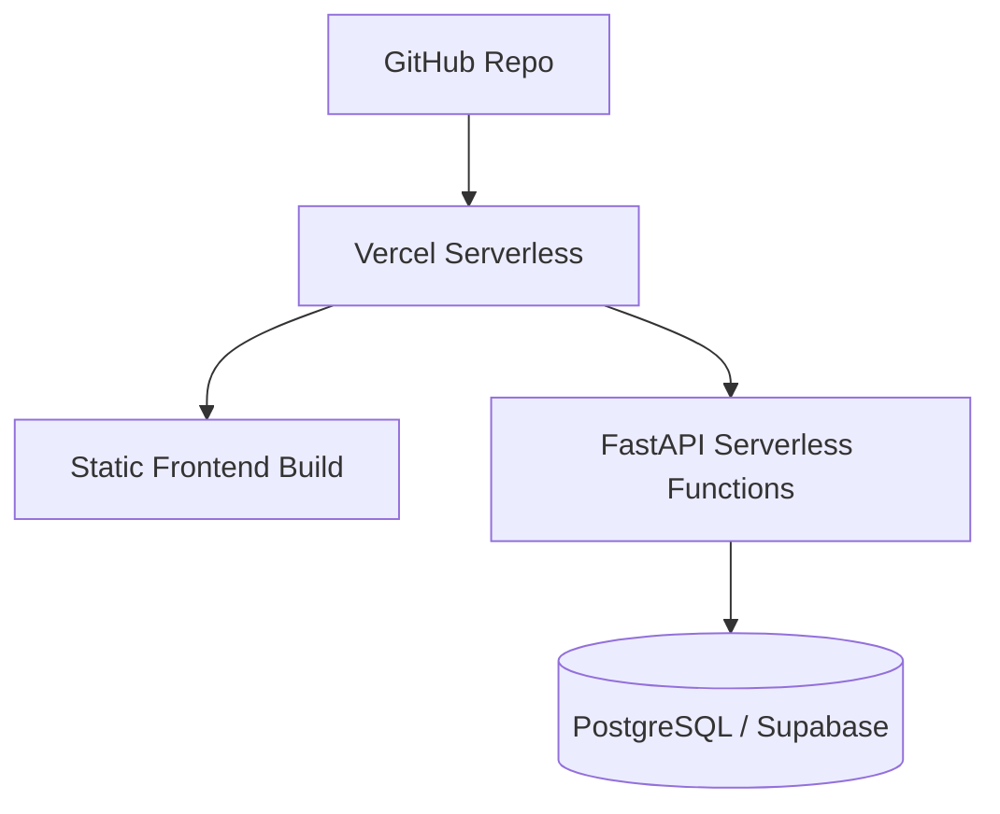

# Vercel Deployment

*STATUS: PLANNED DEPLOYMENT*

## Architecture Concept

## Considerations for Production
1. **Storage**: SQLite is **not supported** natively on Vercel due to the ephemeral serverless environment. A managed PostgreSQL database (e.g., Supabase, Neon) must be configured via environment variables.
2. **Build Step**: Configure `vercel.json` to route `/api/*` to FastAPI, and serve `frontend/` as static assets.
3. **Secrets**: Update Vercel environment variables with secure `JWT_SECRET_KEY` and `DATABASE_URL`.\n